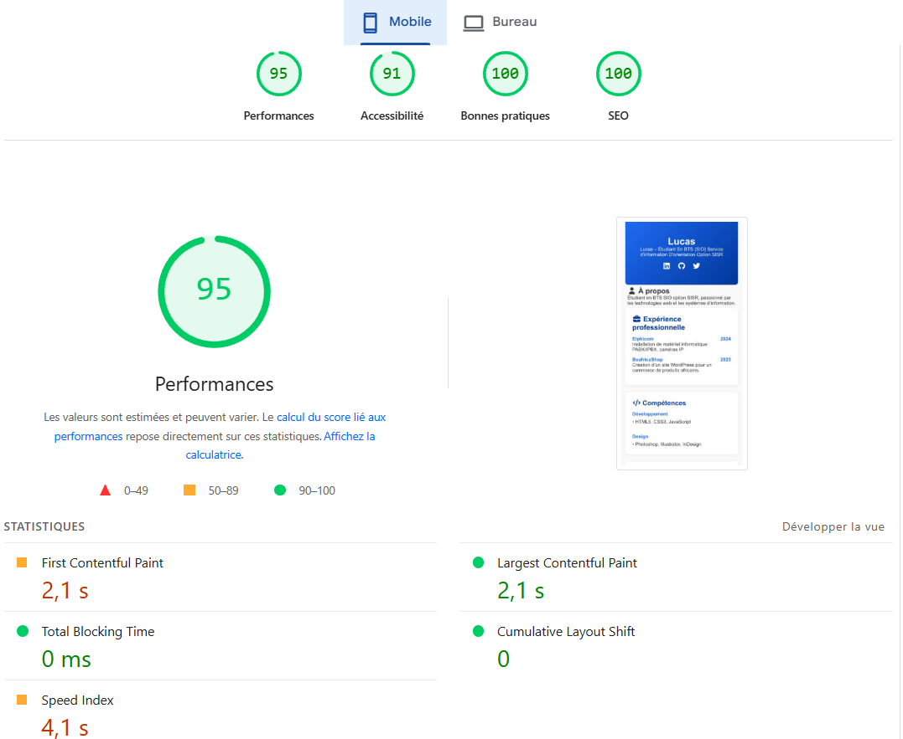

# 📄 Mon CV Web – Lucas

Bienvenue sur mon CV en ligne réalisé dans le cadre du projet de BTS SIO SISR.

Ce site statique est développé en HTML et CSS, avec une mise en page responsive mobile-first. Il est publié via GitHub Pages.

---

## 🚀 Liens utiles

- 🔗 Dépôt GitHub : [https://github.com/saculprotest/saculprotest.github.io/tree/main](https://github.com/saculprotest/saculprotest.github.io/tree/main)
- 🌐 Site en ligne : [https://saculprotest.github.io/page_cv](https://saculprotest.github.io/)

---

## ✅ Auto‑évaluation

### 🔍 Validation W3C

- ✅ 0 erreur
- ✅ Chargement du site en 40 millisecondes

Lien : [validator.w3.org](https://validator.w3.org/)

---

### 📚 Analyse Outiref

- ✅ H1 unique : "Lucas"
- ✅ Hiérarchie des titres respectée : H2 (sections), H3 (sous-parties)
- ✅ Balises sémantiques utilisées : `<header>`, `<main>`, `<section>`, `<footer>`

Lien : [https://outiref.fr/](https://outiref.fr/)

---

### ⚡ PageSpeed Insights (mobile)

- Performance : 93
- Accessibilité : 100
- Bonnes pratiques : 100
- SEO : 95

Lien : [PageSpeed](https://pagespeed.web.dev/)

---

## 🛠️ Améliorations entre la V1 et la version finale

- Ajout de la balise `<meta name="description">` pour le SEO
- Remplacement des icônes seules par des liens avec `aria-label` (accessibilité)
- Ajout des balises `<header>` et `<footer>` (HTML sémantique)
- Correction d’une fermeture de balise incorrecte ``
- Ajout d’un lien GitHub explicite dans la section contact

---

## 📁 Structure du projet

.
├── index.html
├── README.md
└── style.css

---

## 👨‍🎓 Réalisé par : Lucas
Étudiant BTS SIO SISR – 2025

